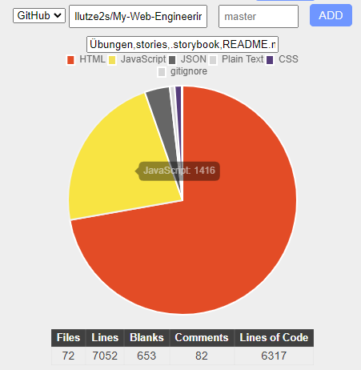

# My-Web-Engineering-APP
Hey there,
this is an WebApp for my Subject "Web Engineering" at the Hochschule Bonn-Rhein-Sieg.

Webseite:  https://llutze2s.github.io/My-Web-Engineering-APP/

Storybook: https://main--61a393ea09f3dc003ad67531.chromatic.com/   (npx chromatic --project-token=45fe4424b8dc)

## Line of Code count:
<i>Quelle: https://codetabs.com/count-loc/count-loc-online.html</i>

## Inhaltsverzeichnis für die Übungen
1. [Einführung](./Übungen/Übung1.md)
2. [Responsive Web Design](./Übungen/Übung2.md)
3. [JavaScript](./Übungen/Übung3.md)
4. [DOM](./Übungen/Übung4.md)
5. [Async & Promises](./Übungen/Übung5.md)
6. [SVG](./Übungen/Übung6.md)
7. [Node.js](./Übungen/Übung7.md)
8. [Modular](./Übungen/Übung8.md)
9. [Progressive Web App](./Übungen/Übung9.md)
10. [Vue](./Übungen/Übung10.md)

