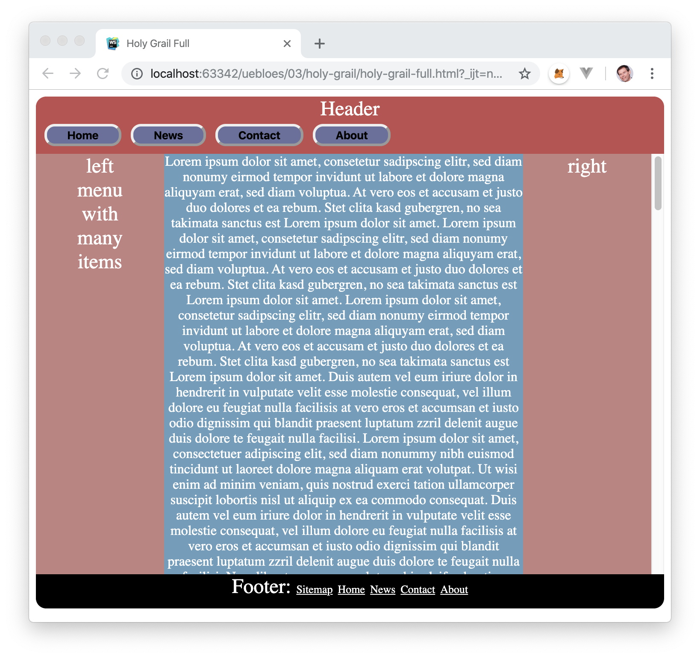

# Übung 2

## 2.1. Responsiv mit Flexbox Desktop-First (3 Punkte)
Spielen Sie zunächst das Flexbox Froggy-Spiel, um Flexbox zu lernen.

Implementieren Sie dann ausschließlich mit HTML und CSS Flexbox folgendes responsive Webdesign nach der Desktop-First-Strategie!


```html
<!DOCTYPE html>
<html>
    <head>
        <style>
            .page {
                display: flex;
                flex-direction: column;
                text-align: center;
                width: 100vw;
            }

            .bottom {
                display: flex;
                flex-direction: row;
                height: 80vh;
            }

            .headline {
                background-color: red;
                height: 20vh;
            }

            .left{
                background-color: green;
                flex-grow: 1;
                flex-shrink: 1;
            }

            .content{
                background-color: blue;
                flex-grow: 4;
                flex-shrink: 4;
            }
            
            .right{
                background-color: violet;
                flex-grow: 1;
                flex-shrink: 1;
            }

            /* joegalley.com/articles/mobile-first-vs-desktop-first-media-queries */
            @media (max-width: 992px) {	
                .page {
                    display: flex;
                    flex-direction: column;
                    text-align: center;
                }

                .bottom {
                    display: flex;
                    flex-direction: row;
                    flex-wrap: wrap;
                }
            }

            @media (max-width: 768px) {
                .page {
                    display: flex;
                    flex-direction: column;
                    text-align: center;
                }

                .bottom {
                    display: flex;
                    flex-direction: column;
                }
            }
        </style>
    </head>
    <body>
        <div class="page">
            <div class="headline"><h1>Headline</h1></div>
            <div class="bottom">
                <div class="left">Left</div>
                <div class="content">Content</div>
                <div class="right">Right</div>
            </div>
        </div>
    </body>
</html>
```

## 2.2. Responsiv mit Grid Mobile-First (2 Punkte)
Spielen Sie zunächst das Grid Garden -Spiel, um Grid Layout zu lernen.

Implementieren Sie dann das gleiche responsive Webdesign wie in Aufgabe 2.1 allerdings mit Grid und der Mobile-First-Strategie! Vermeiden Sie diesmal außerdem das Erscheinen von Scrollbars.

```html
<!DOCTYPE html>
<html>
    <head>
        <style>
            .page {
                display: grid;
                grid-template-columns: 1fr;
                grid-template-rows: 1fr 1fr 3fr 1fr;
                background-color: white;
                grid-gap: 1px;
                justify-content: stretch; 
            }

            .headline {
                grid-row: 1;
                grid-column: span 3;
                text-align: center;
                background-color: red;
            }

            .left{
                grid-row: 2;
                grid-column: span 2;
                text-align: center;
                background-color: green;
            }

            .content{
                grid-row: 3;
                grid-column: span 2;
                text-align: center;
                background-color: blue;
            }
            
            .right{
                grid-row: 4;
                grid-column: span 2;
                text-align: center;
                background-color: violet;
            }

            /* joegalley.com/articles/mobile-first-vs-desktop-first-media-queries */
            @media (min-width: 992px) {	
                .page {
                    display: grid;
                    grid-template-rows: 1fr 2fr 1fr;
                    grid-template-columns: 1fr 2fr;
                    background-color: white;
                    grid-gap: 1px;
                    justify-content: stretch;
                }

                .left{
                    grid-row: 2;
                    grid-column: 1;
                }

                .content{
                    grid-row: 2;
                    grid-column: 2;
                }
                
                .right{
                    grid-row: 3;
                    grid-column: span 3;
                }
            }
            
            @media (min-width: 1200px) {
                .page {
                    display: grid;
                    grid-template-rows: 1fr 3fr;
                    grid-template-columns: 1fr 2fr 1fr;
                    background-color: white;
                    grid-gap: 1px;
                    justify-content: stretch;
                }
  
                .left{
                    grid-row: 2;
                    grid-column: 1;
                }

                .content{
                    grid-row: 2;
                    grid-column: 2;
                }
                
                .right{
                    grid-row: 2;
                    grid-column: 3;
                }
            }
        </style>
    </head>
    <body>
        <div class="page">
            <div class="headline"><h1>Headline</h1></div>
            <div class="left">Left</div>
            <div class="content">Content</div>
            <div class="right">Right</div>
        </div>
    </body>
</html>
```

## 2.3 Holy Grail(3 Punkte)
Implementieren Sie ausschließlich mit HTML und CSS folgendes responsive Webdesign. Vermeiden Sie das Erscheinen von Scrollbars so weit wie möglich. Andererseits sollten der Viewport sowohl horizontal als auch vertikal zu 100% genutzt werden, d.h. vermeiden Sie weiße Flächen.



Flexbox:
```html
<!DOCTYPE html>
<html>
    <head>
        <style>
            body{
                width: 100%;
                height: 100%;
                overflow-x: scroll;
            }

            .page {
                display: flex;
                flex-wrap: wrap;
                text-align: center;
            }

            .headline {
                background-color: #C04F4F;
                width: 100%;
            }

            .menuband {
                display: flex;
                flex-direction: row;
            }

            .left{
                background-color: #C28281;
                width: 20%;
            }

            .content{
                background-color: #6A9EBD;
                width: 60%;
            }
            
            .right{
                background-color: #C28281;
                width: 20%;
            }

            .footer{
                background-color: #000000;
                width: 100%;
            }

            button{
                background-color: #6A709F;
                color: black;
                font-weight: bold;
                border-radius: 20px;
                box-shadow: 15px;
                margin: 5px;
            }

            /* joegalley.com/articles/mobile-first-vs-desktop-first-media-queries */
            @media (max-width: 992px) {	
                .content{
                    width: 80%;
                }
                .right{
                    width: 100%;
                }
            }

            @media (max-width: 768px) {
                .content, .left, .right{
                    width: 100%;
                }
            }
        </style>
    </head>
    <body>
        <div class="page">
            <div class="headline">
                <h1>Header</h1>
                <div class="menuband">
                    <button>Home</button>
                    <button>News</button>
                    <button>Contact</button>
                    <button>About</button>
                </div>
            </div>
            <div class="left">
                left</br>
                menu</br>
                with</br>
                many</br>
                items</br>
            </div>
            <div class="content">Lorem ipsum dolor sit amet, consetetur sadipscing elitr, sed diam nonumy eirmod tempor invidunt ut labore et dolore magna aliquyam erat, sed diam voluptua. At vero eos et accusam et justo duo dolores et ea rebum. Stet clita kasd gubergren, no sea takimata sanctus est Lorem ipsum dolor sit amet. Lorem ipsum dolor sit amet, consetetur sadipscing elitr, sed diam nonumy eirmod tempor invidunt ut labore et dolore magna aliquyam erat, sed diam voluptua. At vero eos et accusam et justo duo dolores et ea rebum. Stet clita kasd gubergren, no sea takimata sanctus est Lorem ipsum dolor sit amet.Lorem ipsum dolor sit amet, consetetur sadipscing elitr, sed diam nonumy eirmod tempor invidunt ut labore et dolore magna aliquyam erat, sed diam voluptua. At vero eos et accusam et justo duo dolores et ea rebum. Stet clita kasd gubergren, no sea takimata sanctus est Lorem ipsum dolor sit amet. Lorem ipsum dolor sit amet, consetetur sadipscing elitr, sed diam nonumy eirmod tempor invidunt ut labore et dolore magna aliquyam erat, sed diam voluptua. At vero eos et accusam et justo duo dolores et ea rebum. Stet clita kasd gubergren, no sea takimata sanctus est Lorem ipsum dolor sit amet.</div>
            <div class="right">right</div>
            <div class="footer">
                    <h2>Footer: </h2> <u>Sidemap</u> <u>Home</u> <u>News</u> <u>Contact</u> <u>About</u>
            </div>  
        </div>
    </body>
</html>
```

Gridview:
```html
<!DOCTYPE html>
<html>
    <head>
        <style>
            .page {
                display: grid;
                grid-template-columns: 1fr;
                grid-template-rows: 1fr 1fr 3fr 1fr 1fr;
                background-color: white;
                grid-gap: 1px;
                justify-content: stretch; 
            }

            .menuband {
                display: flex;
                flex-direction: row;
            }

            .headline {
                grid-row: 1;
                grid-column: span 3;
                text-align: center;
                background-color: #C04F4F;
            }

            .left{
                grid-row: 2;
                grid-column: span 2;
                text-align: center;
                background-color: #C28281;
            }

            .content{
                grid-row: 3;
                grid-column: span 2;
                text-align: center;
                background-color: #6A9EBD;
            }
            
            .right{
                grid-row: 4;
                grid-column: span 2;
                text-align: center;
                background-color: #C28281;
            }

            .footer{
                grid-row: 5;
                grid-column: span 2;
                background-color: #000000;
                text-align: center;
            }

            button{
                background-color: #6A709F;
                color: black;
                font-weight: bold;
                border-radius: 20px;
                box-shadow: 15px;
                margin: 5px;
            }

            /* joegalley.com/articles/mobile-first-vs-desktop-first-media-queries */
            @media (min-width: 992px) {	
                .page {
                    display: grid;
                    grid-template-rows: 1fr 2fr 1fr 1fr;
                    grid-template-columns: 1fr 2fr;
                    background-color: white;
                    grid-gap: 1px;
                    justify-content: stretch;
                }

                .left{
                    grid-row: 2;
                    grid-column: 1;
                }

                .content{
                    grid-row: 2;
                    grid-column: 2;
                }
                
                .right{
                    grid-row: 3;
                    grid-column: span 3;
                }

                .footer{
                    grid-row: 4;
                    grid-column: span 3;
                }
            }
            
            @media (min-width: 1200px) {
                .page {
                    display: grid;
                    grid-template-rows: 1fr 3fr 1fr;
                    grid-template-columns: 1fr 2fr 1fr;
                    background-color: white;
                    grid-gap: 1px;
                    justify-content: stretch;
                }
  
                .left{
                    grid-row: 2;
                    grid-column: 1;
                }

                .content{
                    grid-row: 2;
                    grid-column: 2;
                }
                
                .right{
                    grid-row: 2;
                    grid-column: 3;
                }

                .footer{
                    grid-row: 3;
                    grid-column: span 3;
                }
            }
        </style>
    </head>
    <body>
        <div class="page">
            <div class="headline">
                <h1>Header</h1>
                <div class="menuband">
                    <button>Home</button>
                    <button>News</button>
                    <button>Contact</button>
                    <button>About</button>
                </div>
            </div>
            <div class="left">
                left</br>
                menu</br>
                with</br>
                many</br>
                items</br>
            </div>
            <div class="content">Lorem ipsum dolor sit amet, consetetur sadipscing elitr, sed diam nonumy eirmod tempor invidunt ut labore et dolore magna aliquyam erat, sed diam voluptua. At vero eos et accusam et justo duo dolores et ea rebum. Stet clita kasd gubergren, no sea takimata sanctus est Lorem ipsum dolor sit amet. Lorem ipsum dolor sit amet, consetetur sadipscing elitr, sed diam nonumy eirmod tempor invidunt ut labore et dolore magna aliquyam erat, sed diam voluptua. At vero eos et accusam et justo duo dolores et ea rebum. Stet clita kasd gubergren, no sea takimata sanctus est Lorem ipsum dolor sit amet.Lorem ipsum dolor sit amet, consetetur sadipscing elitr, sed diam nonumy eirmod tempor invidunt ut labore et dolore magna aliquyam erat, sed diam voluptua. At vero eos et accusam et justo duo dolores et ea rebum. Stet clita kasd gubergren, no sea takimata sanctus est Lorem ipsum dolor sit amet. Lorem ipsum dolor sit amet, consetetur sadipscing elitr, sed diam nonumy eirmod tempor invidunt ut labore et dolore magna aliquyam erat, sed diam voluptua. At vero eos et accusam et justo duo dolores et ea rebum. Stet clita kasd gubergren, no sea takimata sanctus est Lorem ipsum dolor sit amet.</div>
            <div class="right">right</div>
            <div class="footer">
                <b>Footer: </b> <u>Sidemap</u> <u>Home</u> <u>News</u> <u>Contact</u> <u>About</u>
            </div>  
        </div>
    </body>
</html>
```

## 2.4. Responsiv mit Grid (2 Punkte)
Implementieren Sie folgende Landing Page responsiv mit Grid Layout. Vermeiden Sie außerdem das Erscheinen von Scrollbars so weit wie möglich.

```html
<!DOCTYPE html>
<html>
    <head>
        <style>
            .grid {
                height: 100vh;
                width: 100vw;
                display: grid;
                grid-template-rows: 1fr 1fr 4fr 1fr;
                grid-template-columns: 1fr 1fr;
            }
            .header{
                grid-row: 1;
                grid-column: span 2;
                text-align: center;
                background-color: #363636;
                color: white;
                padding: 10px;
                line-height: 40px;
            }
            .title{
                grid-row: 2;
                grid-column: span 2;
                background-color: #EBEAE5;
                text-align: center;
                font-size: 28px;
                color: black;
            }
            .left {
                grid-row: 3;
                grid-column: 1;
                background-color: #EBEAE5;
            }
            .right {
                grid-row: 3;
                grid-column: 2;
                background-color: #EBEAE5;
                color: black;
                text-align: center;
                padding-top: 5%;
                font-weight: bold;
                font-size: 15px;
            }
            .footer {
                grid-row: 4;
                grid-column: span 2;
                background-color: #061825;
                text-align: center;
                color: #747171; 
                font-size: 14px;
                padding: 10px;
            }

            @media (max-width: 768px) {
                .grid {
                    height: 100vh;
                    width: 100vw;
                    display: grid;
                    grid-template-rows: 1fr 1fr 2fr 2fr 1fr;
                    grid-template-columns: 1fr;
                }
                .left {
                    grid-row: 3;
                    grid-column: 1;
                }
                .right {
                    grid-row: 4;
                    grid-column: 1;
                }
                .footer {
                    grid-row: 5;
                    grid-column: 1;
                }
            }

            p{
                margin: 25px;
            }

            .flex{
                padding: 5px;
                display: flex;
                justify-content: center; 
                align-items: center;
            }

            img{
                border: 1px solid black;
                border-radius: 10px;
            }
        </style>
    </head>
    <body>
        <div class="grid">
            <div class="header">
                    The book series
                    Testimonials
                    The Author
                    Free resources
            </div>
            <div class="title">
                <b>You dont know JavaScript</b>
            </div>
            <div class="left">
                <div class="flex">
                    
                </div>
            </div>
            <div class="right">
                <p>Don´t just drift thought javascript.</p>
                <p>Understand how javascrupt works</p>
                <p>Start your journy thought the bumpy side of javascript</p>
                <p><button style="background: #F88E37; border-radius: 5px; width: 80%; color: white;">ORDER YOUR COPY NOW</button></p>
            </div>
            <div class="footer">
                The first ebook in the book series is absolutly free.
                <button style="background: #F88E37; border-radius: 5px; width: 60%; color: white;">FIND OUR MORE ABOUT OFFER</button>
            </div>
        </div>
    </body>
</html>
```