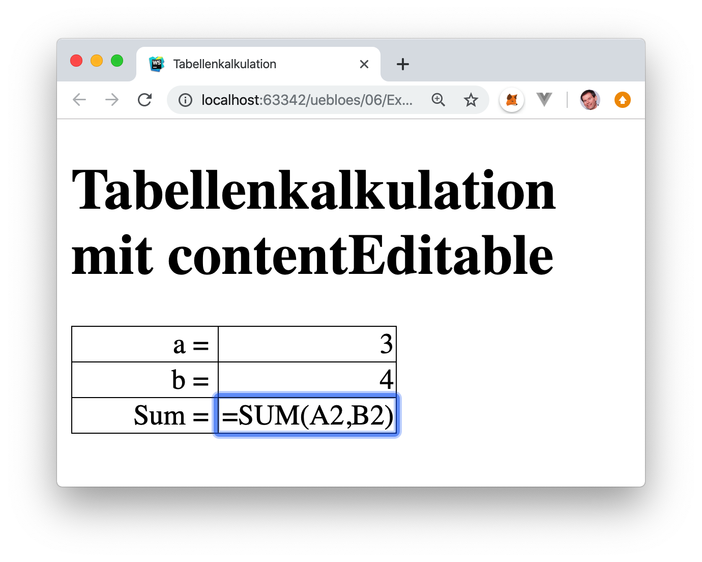

# Übung 4

## 4.1. Einkaufsliste (2 Punkte)
Implementieren Sie die interaktive Anwendung "Einkaufsliste" selbstständig in JavaScript durch Nutzung der DOM API. Jeder Punkt auf der Einkaufsliste soll sich individuell löschen lassen. Suchen Sie eine möglichst kurze und elegante Lösung. Denken Sie außerdem über Usability nach: Welche User Interaktionen sollten ebenfalls erlaubt sein? Implementieren Sie dann auch diese.


```html
<!DOCTYPE html>
<head>
    <title>Einkaufsliste</title>
    <script src="einkauf.js"></script>
</head>
<body onload="init()">
    <h1>Einkaufsliste</h1>
    <p style="display: inline-block;">
        <form>
            Enter a new item: 
            <input id="item">
            <button id="button" type="button" >Add item</button>
        </form>
    </p>
    <ul id="liste">
    </ul>
</body>
</html>
```

```js
function init(){
    var add = document.getElementById('button');
    add.addEventListener('click', AddItem); //hier ohne ()
}

function AddItem(){
    var item = document.getElementById('item'); //Hole Item

    var li = document.createElement('li');  // Baue Listenelement
    li.innerHTML = item.value+" ";             // Fülle mit Inhalt
    item.value = "";                       // leere Feld

    var del = document.createElement('button');
    del.innerHTML = "delete";
    del.addEventListener('click', function(){li.remove();});
    li.appendChild(del);

    var ul = document.getElementById('liste');  // Hole Liste

    ul.appendChild(li);                     // An Liste anhängen
}
```

## 4.2. Rednerliste mit Zeitmessung (2 Punkte)
Implementieren Sie die interaktive Anwendung "Rednerliste mit Zeitmessung" selbstständig in JavaScript durch Nutzung der DOM API und der Timer-Funktionen. Neue Redner sollen auf Knopfdruck hinzugefügt werden können. Deren Uhr wird dann sofort automatisch gestartet und alle anderen Uhren angehalten. Bei jedem Redner soll die individuelle, gemessene Redezeit sekundengenau angezeigt werden. Für jeden Redner soll es einen eigenen Start-/Stopp-Button geben. Es soll immer nur eine Uhr laufen. Angezeigt werden sollen die bisherigen Summenzeiten aller Redebeiträge der betreffenden Person. Suchen Sie eine möglichst kurze und elegante Lösung. Achten Sie gleichzeitig auf gute Usability: z.B. wenn die Eingabe mit einem Return beendet wird, soll der Button-Click nicht mehr erforderlich sein, usw.


```html
<!DOCTYPE html>
<head>
    <title>Rednerliste</title>
    <script src="redner.js"></script>

    <style>
        p{
          display: inline;
          padding: 10px;
        }
        li{
          padding: 5px;
        }
    </style>
</head>
<body onload="init()">
    <h1>Rednerliste</h1>
    <p>
        <form>
            Neuer Redner: 
            <input id="redner">
            <button id="button" type="button" >Hinzufügen</button>
        </form>
    </p>
    <ul id="liste">
    </ul>
</body>
</html>
```

```js
//https://www.w3schools.com/js/js_timing.asp

function init(){
    var add = document.getElementById('button');
    add.addEventListener('click', AddRedner); //hier ohne ()
    setInterval(refresh, 1000);
}

var RednerListe = [];

function refresh(){
    if(RednerListe.length != 0){
        RednerListe.forEach(redner => {
            if(redner.isStopped != false){
                redner.refresh();
            }
        });
    }
}

function AddRedner(){
    var item = document.getElementById('redner'); //Hole Rednername

    var li = document.createElement('li');  // Baue Listenelement
    li.innerHTML = item.value;          // Fülle mit Inhalt
    item.value = "";                        // leere Feld

    var timer = document.createElement('p');
    timer.innerHTML = "0000";
    li.appendChild(timer)

    var stop = document.createElement('button');
    stop.innerHTML = "Stopp!";

    var newRedner = new Redner(li.innerHTML,timer,stop);
    RednerListe.push(newRedner);

    stop.addEventListener('click', function(){newRedner.toogle();});
    li.appendChild(stop);

    var ul = document.getElementById('liste');  // Hole Liste

    ul.appendChild(li);                     // An Liste anhängen
}


// https://gist.github.com/endel/321925f6cafa25bbfbde
// Nur für schönere Zeitausgabe
Number.prototype.pad = function(size) {
    var s = String(this);
    while (s.length < (size || 2)) {s = "0" + s;}
    return s;
  }
/////////////////////////////////////////////////////
  

class Redner {
    timer = 0;
    name = "";
    timerText;
    button;
    stopped = true;

    constructor(name,timer,button){
        this.name = name;
        this.timerText = timer;
        this.button = button;
        button.click();
    }

    get timer(){return this.timer;}
    
    get name(){return this.name;}

    get isStopped(){return this.stopped;}
    
    stop(){
        this.stopped = true;
        this.button.innerHTML = "Start";
    }
    refresh(){
        this.timer++;
        this.timerText.innerHTML = this.timer.pad(4)+"s";
    }
    toogle(){
        if (this.stopped === true) {
            RednerListe.forEach(item => {item.stop();}); // Alle anderen anhalten
            this.button.innerHTML = "Stop";
            this.stopped = false;
        } else {
            this.stopped = true;
            this.button.innerHTML = "Start";
        }
    }
}
```

## 4.3. Tabellenkalkulation mit den Bordmitteln des Webs (3 Punkte)
Schreiben Sie eine Tabellenkalkulation mit den Bordmitteln des Webs. In die Tabelle soll man Zahlen und Formeln eintragen können. Die Formeln sollen berechnet werden, sobald sie fertig eingegeben sind, aber auch immer wieder editiert werden können. Beginnen Sie mit einfachen Summenformeln wie `=SUM(A2:D2)`.




```html

```

```js

```

## 4.4. HTML-Editor (3 Punkte)
Arbeiten Sie das Tutorial Create a WYSIWYG Editor With the contentEditable Attribute durch und erstellen Sie Ihren eigenen HTML-Editor.

(Optional: Versuchen Sie dabei ohne Frameworks auszukommen, also ohne jQuery etc. Arbeiten Sie nur mit Vanilla JS.)


```html

```

```js

```